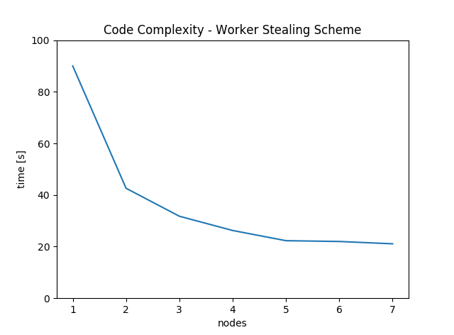

# Cyclomatic Complexity

## Setup 

This Project was built using Python 3.6 and Flask

Setting up the server and clients can be done by running the following commands:

```
python cyclo_master.py --host=[MASTER_IP] --port=[PORT]
python cyclo_worker.py --host=[MASTER_IP] --port=[PORT]    

Once cyclo_master is running, you can start as many workers as you want. 
Each worker will start requesting once started. The master will only start
allocating tasks to worker by submitting a PUT request to the master with any content.
```

- The selected repository can be changed in the cyclo_config.json file
- Each worker will download its copy of the given repository
- Each worker calculates the cyclomatic complexity for all files for one commitnumber
- The master distributes all commits of the repository using the worker-stealing scheme
- Data such as the calculated complexity and time are saved in .csv files and the end of the run.


## Result



As seen from the graph more nodes cleary reduce the total time 
to calculate the cyclomatic complexity. The time saturates at 21s with 
5 nodes or more where IO operations become the bottleneck of the process.